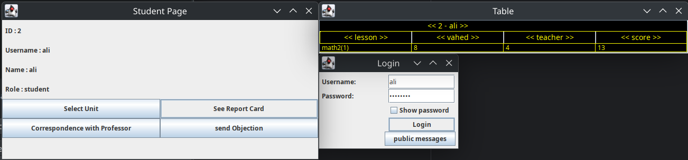
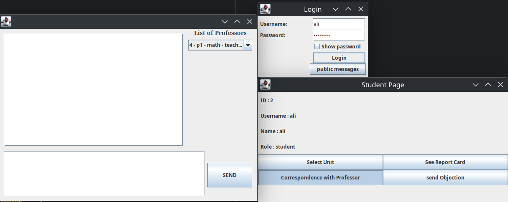
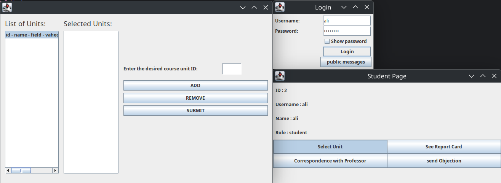

# Advanced-University-Education-System-Advanced-Programming-Project-4

This project is a program designed to manage a school or university that implements a **GUI-based**, **multi-user**, **networked application** using **Java Swing**, **Socket Programming**, and **Multithreading**.

Designed as a complete **client-server system**, it enables multiple users—including **students**, **professors**, **department managers**, and **admins**-to log in, manage educational tasks, and interact with the system in real time.

## 👥 User Roles

Each user logs in using a **Username** and **Password** and is routed to a role-specific panel:

*  **Admin Panel** – Manage users and system-wide configurations
*  **Department Manager Panel** – Manage professors, course offerings, and departmental affairs
*  **Student Panel** – Register for courses, view grades and schedules
*  **Professor Panel** – Manage class lists, submit grades, and interact with students

## 💡 Features

*  **Java Swing GUI**: Responsive and user-friendly graphical interface
*  **Socket-Based Communication**: Robust client-server interaction
*  **Multi-threaded Server**: Handles multiple client sessions concurrently
*  **Authentication System**: Role-based login and secure access control
*  **Educational Tools**: Course registration, grade entry, student record management

## 🛠️ Technologies Used

* `Java SE`
* `Java Swing` for GUI
* `Socket Programming` (TCP)
* `Multithreading` for concurrent user handling
* `SQLite Database` for storing data

# Pictures

# Team members:
 https://github.com/BehrazFS  
  https://github.com/Pooria82